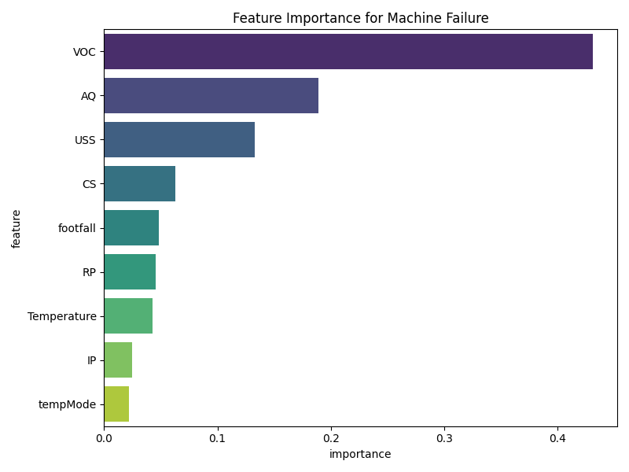
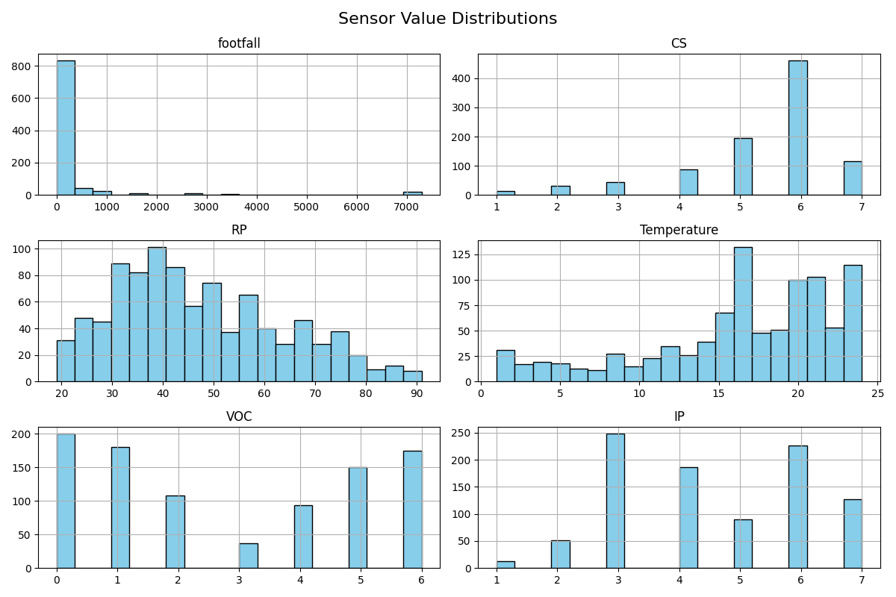
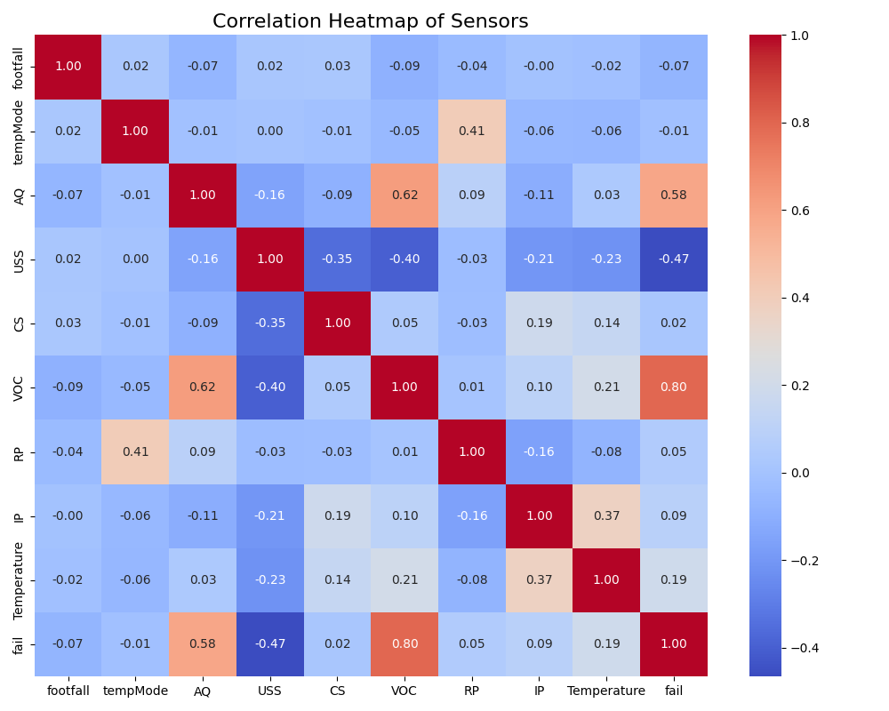

# Machine Failure Prediction

This project predicts machine failures using sensor data and provides preventive alerts.

## Dataset
- 944 rows, 10 columns
- Sensors: footfall, tempMode, AQ, USS, CS, VOC, RP, IP, Temperature
- Target: fail (1 = machine failed, 0 = no failure)

## Steps
1. Data Exploration & Visualization
2. Train Random Forest Classifier
3. Feature Importance, Correlation, Sensor Histograms
4. Predictive Maintenance Alert System

## Results
- Model Accuracy: 0.88
- Feature Importance, Sensor Distributions, Correlation Heatmap are saved as images.

## Plots

